 Panda Framework
=================

## 概要
Panda Frameworkは企業むけ高品質なJava Webシステムを効率的に開発するためのフレームワークである。
設計、開発、保守全ての開発フェースに対し、開発コストを削減、品質を向上するために設計されています。
Spring / Struts2 / Hibernateなど普及しているJavaアプリケーションフレームワークと比較すれば、Pandaは小さく、使いやすく、開発しやすいです。

## 特徴とメリット
1. ソースコードの自動生成
Panda Frameworkのコードジェネレータを使用し、Action/Dao/Bean/Viewソースコードを自動生成することにより、開発コストが大幅削減。

2. 開発者はSQLを書く必要がありません
データ構造を定義してあるXMLで、テーブル作成などのDDL SQLとデータアクセスクラスDAOのJAVAソースコードが自動的に生成できます。データベースの構築が容易になり、ビジネスロジックのデータアクセス部分もDAOクラスを利用することによって簡単にプログラムできます。
（※複雑のSQL除外）

3. HTML画面⇒PDF帳票変換機能
商用のPDF帳票作成ツールで専門の帳票画面を作成する必要がありません。HTML⇒PDF変換機能で、HTML画面がそのままPDF帳票に変換できるため、開発コストが大幅削減。

4. 業務ロジックの作成が簡単
業務開発者は、Panda Frameworkの各種機能を利用することにより、業務処理の開発のみに集中することができます。「検索、一覧、表示、追加、更新、削除」のような基本機能をテンプレート化したクラスを利用することによって、業務ロジックを速やかに作成できます。

5. 生産性の向上と品質の均一
自動生成されたソースコードをベースにして開発を行うことで、生産性の向上と品質の均一化が図れます。

6. 導入しやすい
導入から開発への初期導入コストを低減する整備された豊富なドキュメント・サンプルを提供しています。

## Panda Frameworkの適用効果イメージ
Panda Frameworkを適用することにより、効果的な開発と運用保守が図れます。
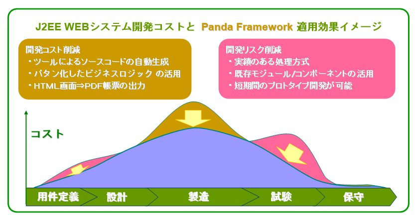

## Panda Frameworkを適用するシステム構成図

## Panda Frameworkの構成

Panda Frameworkは下記のモジュールで構成されている。

 | 模块                           | 说明                                                                      |
 |--------------------------------|---------------------------------------------------------------------------|
 | [panda-core](core/index_ja.md) | 各種ユーティリティクラス。   |
 | [panda-gear](gear/index_ja.md) | [IOC](gear/ioc/ioc_ja.md)/[MVC](gear/mvc/mvc_ja.md)/Taglibモジュール。       |
 | [panda-glue](glue/index_ja.md) | [ASM](glue/asm_ja.md)/[AOP](glue/aop_ja.md)モジュール。                  |
 | [panda-html](html/index_ja.md) | jQuery、Bootstrapなどを含むCSS/JavaScriptモジュール。 |
 | [panda-lane](lane/index_ja.md) | CRUD機能/ユーザー認証機能などを実装した拡張モジュール。 |
 | [panda-tool](tool/index_ja.md) | コードジェネレータ。 |
 | [panda-tube](tube/index_ja.md) | Web Service APIのクライアント（WordPress XMP-RPC, Google Vision APIなど）。    |

## コードジェネレータの紹介

### コードジェネレータの概要
コードジェネレータは、画面およびデータの定義情報とテンプレートをもとに、データの照会・更新等を行うWebアプリケーションのソースコードを自動生成する。
入力・表示項目や、型・桁数に関する定義については、お客様の指定に容易に合わせられるよう、デザインされている。

業務固有の処理については、更新時の排他チェックや追加時の重複チェック等の枠組みのみを提供し、実装は開発者が行う。
自動生成されたソースコードをベースとして開発を行うことで、生産性の向上と品質の均一化が図れる。

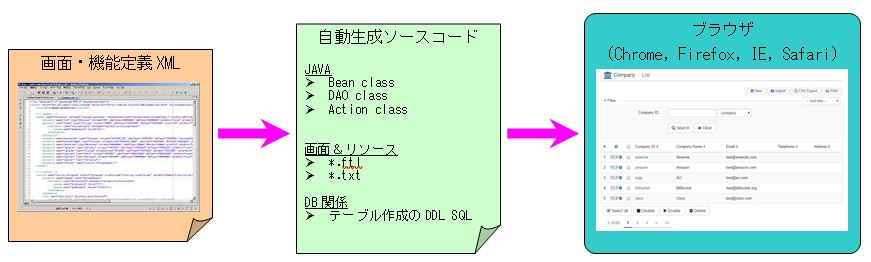

### コードジェネレータの適用効果イメージ
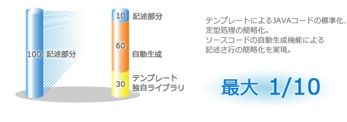

### コードジェネレータ生成可能な機能
コードジェネレータは下記の機能を生成することが可能である。
また、その機能をテンプレートとしてカスタマイズの機能を生成することも可能です。

 | No. | 機能名称                | 説明 |
 |-----|------------------------|-------------|
 | 1   | 検索機能                | データを検索する	検索。                |
 | 2   | 一覧表示機能            | 検索結果一覧を表示する機能。  |
 | 3   | 一覧表示機能（印刷用）    | データの一覧を印刷用に表示する機能。 |
 | 4   | 詳細表示機能            | データの詳細情報を表示する機能。          |
 | 5   | 詳細表示機能（印刷用）    | データの詳細情報を印刷用に表示する機能。  |
 | 6   | 新規追加機能            | データを新規追加する機能。                 |
 | 7   | 複写追加機能            | データを複写追加する機能。         |
 | 8   | データ変更機能            | データを変更する機能。          |
 | 9   | データ削除機能            | データを削除する機能。             |
 | 10  | データエクスポート機能       | データをCSV/XLSファイルにエクスポートする機能。     |
 | 11  | データインポート機能        | CSV/XLSファイルのデータをインポートする機能。  |
 | 12  | 一括処理機能            | 複数のデータを一括処理する機能。         |

### コードジェネレータ生成されたWEB画面の遷移図
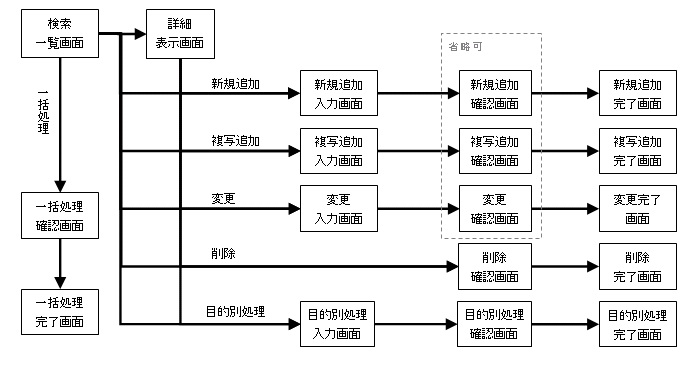

### コードジェネレータ生成されたWEB画面のスクリーンショット

#### 検索一覧画面
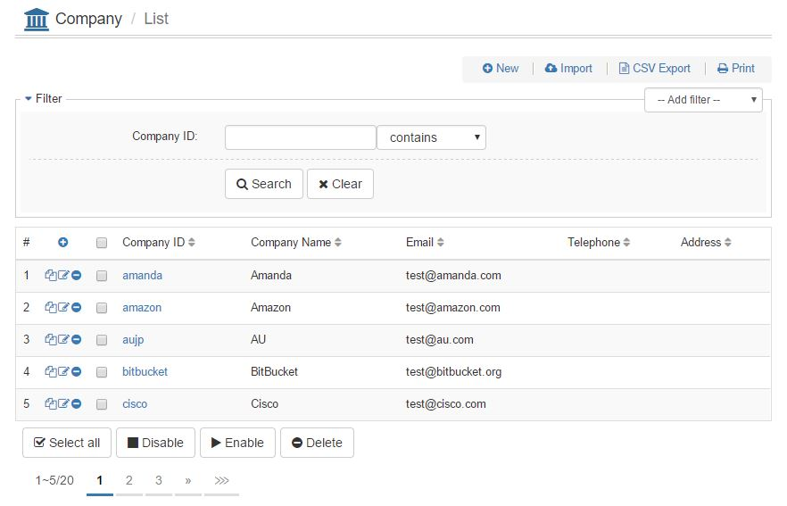

#### 詳細表示画面
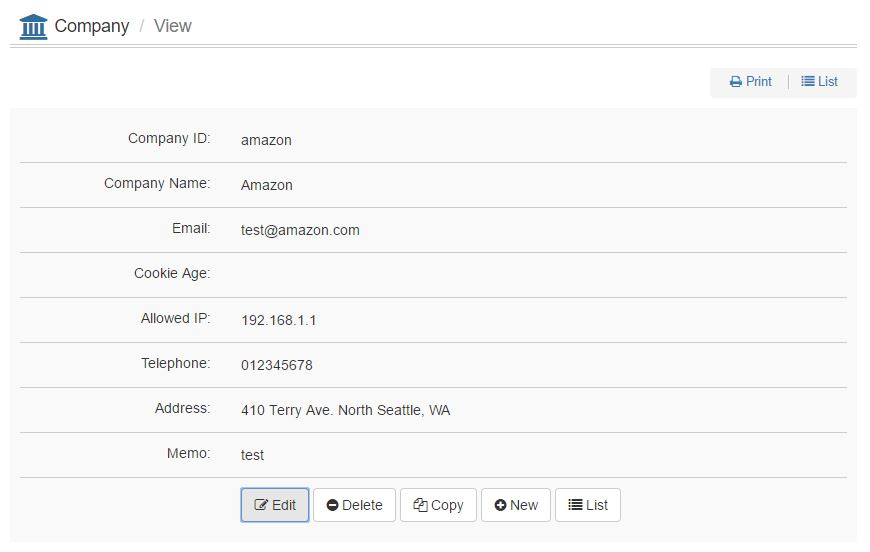

#### 新規追加入力画面
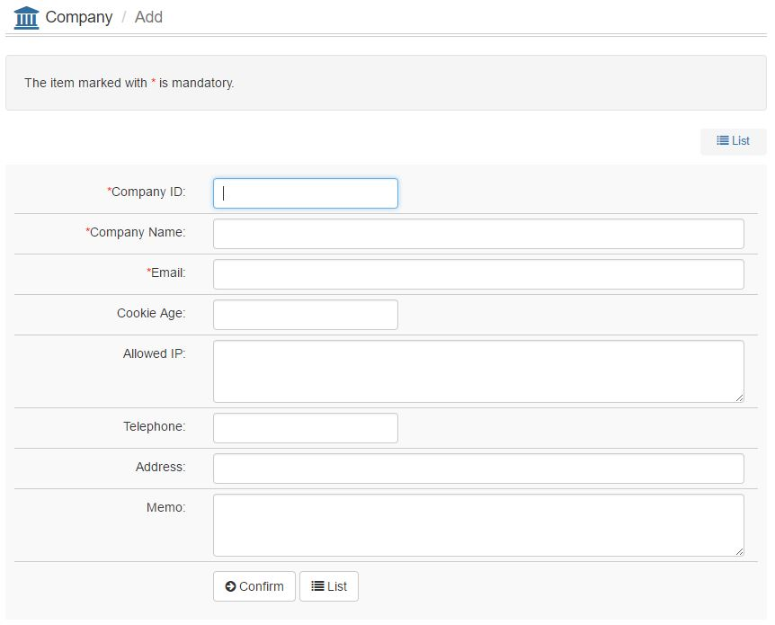

#### 新規追加確認画面
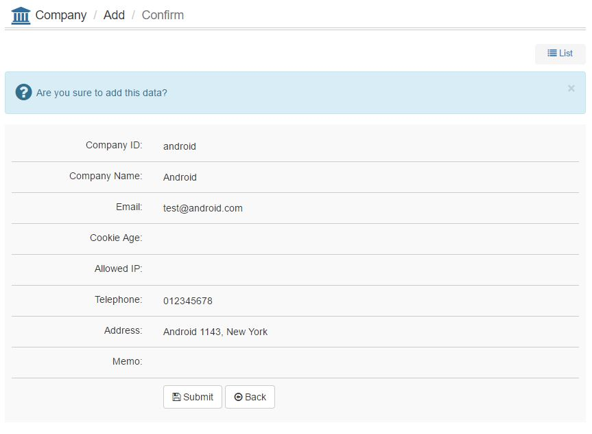

#### 新規追加完了画面
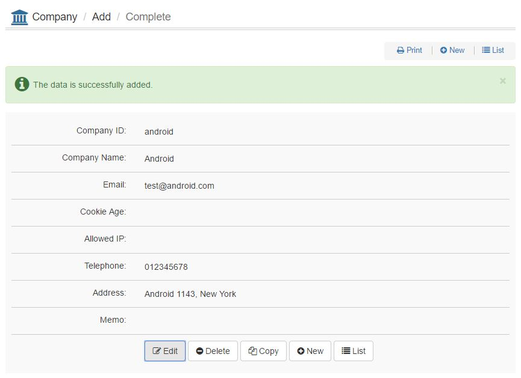

#### 変更入力画面
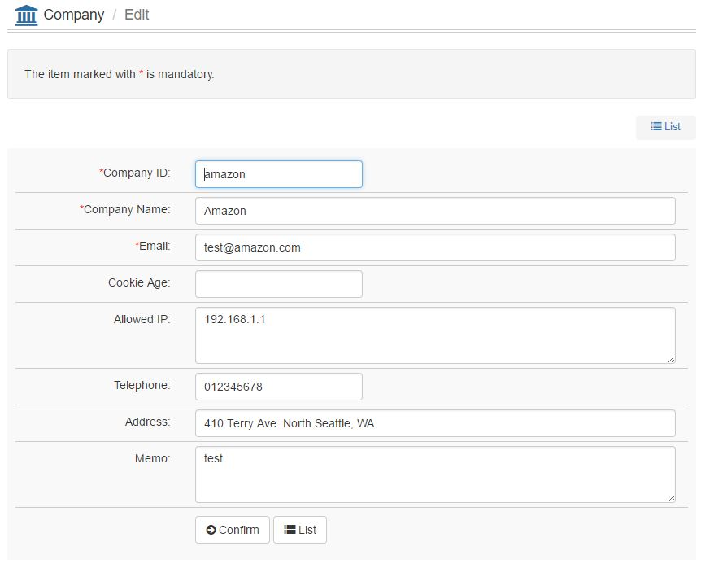

#### 変更確認画面
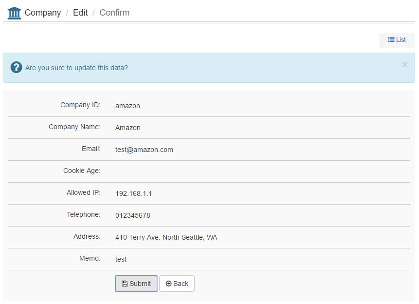

#### 変更完了画面

#### 削除確認画面
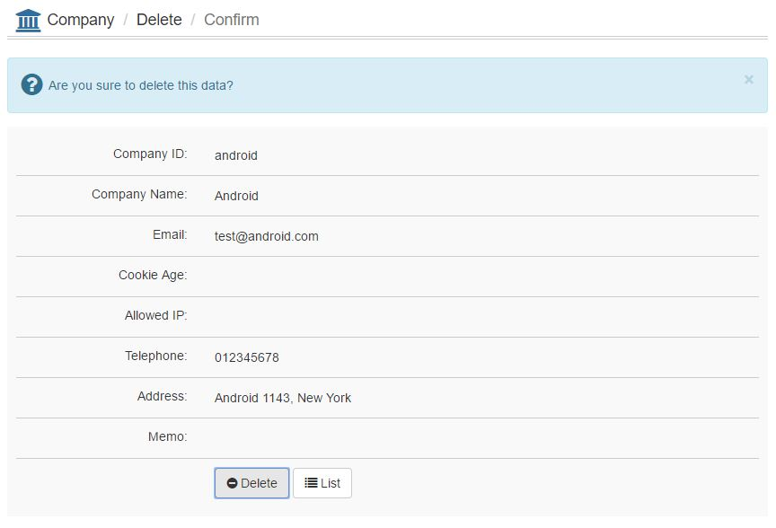

#### 削除完了画面
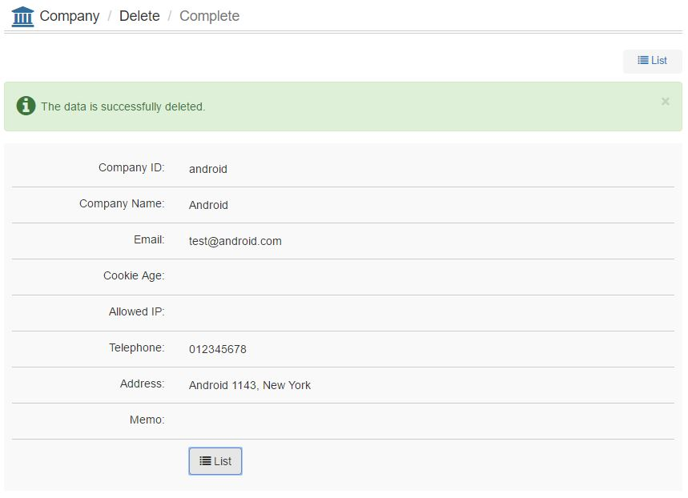

#### 一括削除確認画面

#### 一括削除完了画面
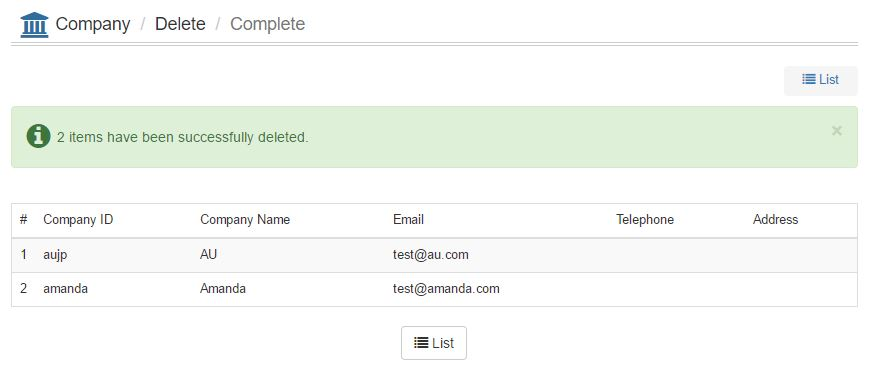

