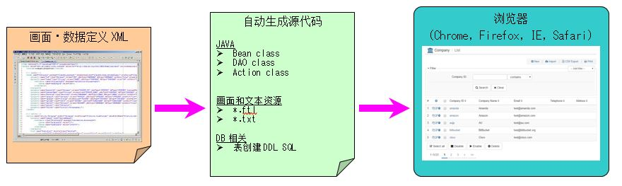
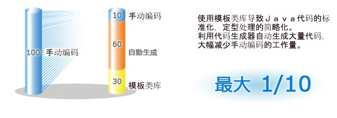
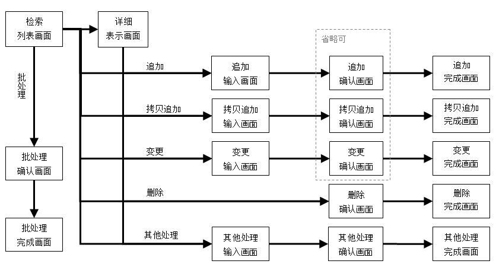

 Panda Framework
=================

## 概要
Panda Framework是一个小而全，可扩展的开发框架，主要用于建立企业级的Java Web应用。
该框架旨在简化整个开发周期（设计，建设，部署，以及维护应用），降低开发费用，提高产品质量。
对比Spring/Struts2/Hibernate这些流行的Java应用框架，Panda的特点是小而全，上手简单，开发容易。

## 特点和优点
1. 自动生成大量源代码  
使用Panda Framework的代码生成器，可以自动生成大量的源代码(Action/Dao/Bean/View)，极大幅度的削减开发费用。

2. 不需要编写SQL（※复杂的SQL除外）  
根据数据结构定义XML文件，可以自动生成关于表创建的SQL，数据存储的SQL和JAVA源代码。利用这些自动生成的代码，可以轻松的创建数据库。

3. HTML画面⇒PDF报表转换功能  
不需要使用商用的PDF报表制作工具专门制作报表画面。使用Nuts的HTML⇒PDF转换功能， 可以直接把HTML画面转换为PDF报表，大幅削减开发费用。

4. 业务逻辑的开发简单  
开发人员利用Panda Framework的各种功能，可以集中精力开发业务逻辑。「检索、列表、显示、追加、变更、删除」这样的基本功能都已经被模板化，利用这些模板可以很轻松的制作业务逻辑。

5. 提高工作效率和程序质量  
在自动生成的源代码的基础上进行开发，可以最大化的提高工作效率，提高程序代码质量。

6. 易投入、易使用  
大量丰富的文档及样本使得框架的初期投入费用大为减少。

## Panda Framework的开发效果
使用Panda Framework，可以大幅提高项目开发及维护效率。

## 使用Panda Framework的系统构成图

## Panda Framework的构成

Panda Framework由以下模块构成。

 | 模块                           | 说明                                                                      |
 |--------------------------------|---------------------------------------------------------------------------|
 | [panda-core](core/index_zh.md) | 这是Panda框架中最基础的部分，它包含了类似apache-commons的许多有用的类。   |
 | [panda-gear](gear/index_zh.md) | [IOC](gear/ioc/ioc_zh.md)/[MVC](gear/mvc/mvc_zh.md)模块。类似Spring-MVC, Struts2。包含了一些常用的Taglib。            |
 | [panda-glue](glue/index_zh.md) | [ASM](glue/asm_zh.md)/[AOP](glue/aop_zh.md)模块。                  |
 | [panda-html](html/index_zh.md) | 包含了jQuery, Bootstrap, 以及panda-gear中一些taglib所需要的css/javascript。|
 | [panda-tool](tool/index_zh.md) | 源代码生成器。可以自动生成Entity类, Query类, Dao类, Action类, View的Freemarker(HTML)模板文件。 |
 | [panda-tube](tube/index_zh.md) | Web Service API的客户端（WordPress XMP-RPC, Google Vision API）。                           |
 | [panda-wear](wear/index_zh.md) | Web-APP扩展模块。包含了实现CRUD的基础模板类，用户认证/权限管理的基础类，和一些其他的有用的类。|

## 代码生成器的介绍

### 代码生成器的概要
代码生成器根据画面和数据定义XML文件以及模板文件自动生成数据浏览，修改变更的WEB应用程序代码。
输入/表示项目、数据的类型・长度・格式都可以根据客户的要求进行设置及调整。

业务逻辑的具体处理、更新時的排他验证以及追加時的重复验证等的功能，都会提供相关的模板给开发人员进行参考。
在自动生成的源代码的基础上进行开发，可以最大化的提高工作效率，提高程序代码质量。

### 使用代码生成器的效果

### 代码生成器可以生成的业务功能
如表所示，代码生成器可以生成以下的业务功能。
并且，以这些业务功能为模板可以制定符合客户需要的特定业务功能。

 | No. | 业务功能名称            | 说明 |
 |-----|------------------------|-------------|
 | 1   | 检索功能                | 数据检索。                |
 | 2   | 列表显示功能            | 检索结果以列表方式显示，支持排序和分页。  |
 | 3   | 列表印刷显示功能        | 数据列表用于印刷的显示功能。 |
 | 4   | 详细显示功能            | 数据的详细内容的显示功能。          |
 | 5   | 细印刷显示功能          | 数据的详细内容用于印刷的显示功能。   |
 | 6   | 数据追加功能            | 数据的追加功能。                  |
 | 7   | 数据拷贝功能            | 数据的拷贝功能。           |
 | 8   | 数据变更功能            | 数据的变更功能。                |
 | 9   | 数据删除功能            | 数据的删除功能。                |
 | 10  | 数据导出功能            | 以CSV/XLS格式导出数据的功能。      |
 | 11  | 数据导入功能            | 从CSV/XLS文件中导入数据的功能。     |
 | 12  | 批处理功能              | 多条数据的批处理功能。            |

### 代码生成器生成的WEB画面迁移图

### 代码生成器生成的WEB画面截图

#### 检索列表画面

#### 详细显示画面

#### 追加输入画面

#### 追加确认画面

#### 追加完成画面

#### 変更输入画面

#### 変更确认画面

#### 変更完成画面

#### 削除确认画面

#### 削除完成画面

#### 批处理削除确认画面

#### 批处理削除完成画面

一些感想
---------------------------

Panda Framework的最大亮点或许是panda-tool这个源代码生成器吧。

许多做WEB应用的同学都会发现，好多页面（画面）的功能不外乎“列表/新建/修改/删除”这四种。
好多代码都是重复编写，又烦又累。所以我就想开发一个源代码生成器，通过一个XML定义文件来生成我需要的代码。  

好几年前开发的最初版源代码生成器生成的源代码是基于Struts2/iBatis2的，但是有许多我想要的功能都没有办法实现。
正在那时，我看到了国内wendal大大开发的Nutz框架，牛人啊，独自开发了能够实现Spring/Hibernate功能的精巧框架。
很不好意思，我借用了一些Nutz的API设计，修改或自己编写了里面的实现。

断断续续坚持编写了好几年，总算完成了一个我比较满意的框架。
它可以实现Spring/Struts2/Hibernate的一些非常常用的功能。
并且可以通过XML定义文件来自动产生实现“检索/列表/新建/修改/删除”功能的源代码（包括HTML页面及后台处理）。

我做了一个[DEMO网站](http://pandafw.ga)，通过这个DEMO大家可以比较直观的了解Panda Framework。

如果大家觉得panda Framework好用,并且能够对你的工作有帮助，留个言提个建议或写个bug报告的话，我会非常感激。
欢迎Folk。

一些废话
---------------------------
程序员都喜欢写程序，讨厌写文档。我也一样。  
Panda框架的文档，断断续续的坚持了好长时间才写完，感觉比写程序都累。  
可是不写文档的话，谁知道你这个东西是干吗用的？  
很少有那些怪物级的程序员，看程序就像吃饭喝水一样，看看DEMO的源代码就知道这个框架的使用方法的。
所以我对于那些即写出漂亮代码又写出通俗易懂的文档的程序员表示由衷的敬意和感谢。
正是因为他们的无私贡献，才有了现在这个美好的开源世界。

